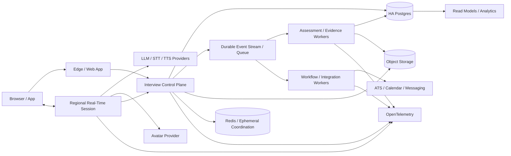

# Think5 Platform v2.1 — Enterprise-Scale Product Requirements Document

**Date:** 2026-09-16  
**Status:** Proposed implementation contract  
**Scope:** Recruiter dashboard, candidate experience, Aria AI interview, backend/platform architecture, integrations, administration, reliability, security and scale  
**Relationship to existing PRD:** This document is additive to `2026-09-16-think5-platform-v2-prd.md`. It does **not** authorize deletion or regression of any existing capability. Where this document is more specific about scale, migration, resilience, provider isolation, design-system convergence or preservation, v2.1 governs.

---

## 0. Executive summary

Think5 should become a complete AI-native recruiting operating system rather than only an AI-interview product with adjacent screens.

The target combines four strengths:

1. **Paraform-level recruiting workflow depth** — sourcing, recruiter collaboration, CRM, matching, scheduling and a network/marketplace option.
2. **micro1-level candidate assessment depth** — adaptive interviews, coding/work samples, interview preparation, candidate feedback and talent credentials.
3. **Mercor-level operational isolation and interview scale** — each active interview must have a small blast radius and no dashboard, avatar, analytics or recruiter workload may be able to terminate active sessions.
4. **Think5 differentiation** — an evidence-first interview engine, a premium branded Aria experience, recruiting across IT, Healthcare, Finance and Construction, plus AI-training expert operations through Forge.

The most important architectural decision in v2.1 is to separate the **Interview Control Plane** from the **Real-Time Media / Avatar Plane**. The control plane owns session truth, interview state, evidence, authorization and versioned scoring inputs. The real-time plane handles audio/video/avatar transport and may fail or change providers without destroying the authoritative interview state.

The platform is designed for a **5,000 simultaneously active AI-interview target plus 10,000+ simultaneous web/dashboard sessions**, but no numeric capacity is considered proven until the required load, soak, reconnect-storm and regional-failure tests pass. The product must degrade gracefully from avatar to voice to accessible text while preserving the same session and evidence trail.

No existing feature may be removed merely because a replacement is being built. Every migration is additive, flagged, observable and reversible until parity is proven.

---

## 1. Product objective

### 1.1 Primary objective

Build a premium end-to-end recruiting platform where a company can:

`Create role → define success profile → source/import talent → screen → schedule → AI interview/assessment → review evidence → collaborate → advance/reject → offer/handoff → measure outcomes`

and where a candidate can:

`Discover/apply → complete profile → preflight → interview/assessment → reconnect safely → receive status/feedback where enabled → manage privacy/data → join talent network`

without requiring disconnected tools for the core workflow.

### 1.2 Business lines supported by the architecture

The platform must support both without forcing them into one brittle workflow:

- **Think5 Recruiting:** employer recruiting for IT, Healthcare, Finance, Construction and startups.
- **Think5 AI Training / Forge:** sourcing, evaluating and operating expert pools for model-training and evaluation projects.

Shared primitives should include identity, talent profiles, skills, interviews, assessments, messaging, scheduling, billing, audit, reporting and integrations. Recruiting-specific and Forge-specific workflow modules should remain separable.

### 1.3 Non-goals for the first implementation wave

- Rewriting the whole product at once.
- Replacing working interview integrity/evidence logic for aesthetic reasons.
- Building a payroll/EOR platform from scratch if a mature provider can be integrated.
- Training a proprietary photoreal avatar model before product-market evidence justifies it.
- Coupling interview availability to any single avatar, LLM, TTS, STT or analytics provider.

---

## 2. Non-negotiable principles

1. **Preserve before replace.** Existing routes, APIs, jobs, data and working flows remain available until replacements have measured parity.
2. **Evidence over opaque scores.** Recruiters see why a conclusion was reached, with transcript/work-sample evidence and rubric provenance.
3. **Server-authoritative interview state.** The browser, avatar vendor and media relay never become the source of truth for interview progression.
4. **Small blast radius.** One interview, tenant, provider or region failure must not cascade across the platform.
5. **Graceful degradation.** Avatar failure must not equal interview failure.
6. **No dead-end UI.** Visible controls must work, be explicitly disabled with explanation, or be absent.
7. **Measured scale, not theoretical scale.** Capacity numbers are accepted only after production-like tests.
8. **Version everything that changes AI behavior.** Interview plan, prompt, model, evaluator, rubric and scoring policy versions are persisted.
9. **Tenant isolation first.** Data, quotas, jobs and expensive queries must not allow one customer to become a noisy neighbor.
10. **Accessible by default.** Candidate accommodations and WCAG requirements are platform behavior, not a later theme.
11. **One visual system.** Public console, recruiter app, admin and candidate surfaces share tokens, typography, spacing and interaction rules.
12. **Human override remains possible.** AI assists and recommends; authorized people can review, annotate and override with an audit trail.

---

## 3. Current-state audit and preservation baseline

The existing v2 audit remains the baseline inventory. Before implementation, engineering must generate a machine-readable preservation manifest containing every current:

- page and route;
- API endpoint and externally consumed contract;
- database model/table/index/RLS policy;
- background job/worker/cron producer and consumer;
- interview state-machine transition;
- transcript/evidence artifact;
- notification/messaging pathway;
- ATS/integration adapter;
- admin control;
- role/permission;
- feature flag;
- public/auth page behavior;
- analytics event relied upon by product or operations.

### 3.1 High-priority defects inherited from the audit

These are **Phase 0 blockers**, not backlog polish. The implementation team must re-confirm each against current `main` immediately before changing it because the repo is moving quickly.

| Area | Current audit finding | Required outcome |
|---|---|---|
| Browser writes / CSRF | Proxy enforces CSRF on state-changing requests while current client paths do not consistently satisfy the contract | One documented CSRF strategy; every browser write covered by integration/E2E tests |
| Interview invite entry | Invite-to-interview flow can lose required access/session token context | Invite link → accept → preflight → interview succeeds end-to-end without manual recovery |
| Proctoring/event persistence | Some voice-path integrity/proctoring signals are not durably persisted | All required events use the same authoritative event/evidence pipeline |
| Candidate results | At least one candidate-results surface is mocked/hard-coded | Results come from versioned real assessment data or are hidden until available |
| Messaging | Client/API contracts are inconsistent | Typed canonical contract plus migration adapter, retries and delivery status |
| ATS | Integration layer exists but is not fully wired into live workflows | At least one full two-way integration proves the framework, including reconciliation |
| SSO | Existing SSO surface does not yet provide a complete production session flow | OIDC/SAML flow establishes/refreshes/revokes Think5 sessions correctly |
| Account security | 2FA is missing | TOTP/passkey-ready MFA, recovery controls and admin enforcement |
| Billing/entitlements | No complete billing/usage entitlement layer | Plans, usage, quotas, invoices/provider integration and entitlement checks |
| Dashboard | Several surfaces/actions/settings are partial, mocked, read-only or dangling | Every exposed action classified as working, deliberately read-only or removed from navigation pending implementation |
| Real-time relay | Current relay topology has single-region / concentrated-failure risk | Multi-region pool, session affinity, evacuation and tested reconnect |
| Redis dependency | Redis failure can block or destabilize new interview creation | Explicit degraded behavior; critical session truth remains durable outside volatile cache |

### 3.2 Preservation contract

No phase may exit unless all of the following pass:

- route/API manifest diff reviewed;
- current golden-path E2E suite green;
- database migration is backward compatible during rollout;
- old and new paths can coexist under flags where a replacement is involved;
- visual regression set covers critical recruiter/candidate flows;
- interview protocol regression/evidence fixtures match expected behavior;
- rollback has been exercised in staging;
- no destructive cleanup occurs in the same release as a replacement cutover;
- observability confirms no unexpected drop in route use, conversion or session completion;
- explicit owner sign-off exists before removing a legacy route/schema/worker.

For data-contract changes use: **expand → dual-write/adapter → backfill → verify → switch reads → observe → contract later**.

---

## 4. Competitive benchmark — September 16, 2026 snapshot

Competitor references are a directional benchmark, not a requirement to copy their UX or business model.

### 4.1 Paraform

Current public materials emphasize a large expert recruiter network, custom AI agents, candidate matching that learns from interview/rejection signals, plus recruiter tooling including sourcing/matching, CRM, scheduling and related workflow support.

**Think5 implication:** interview quality alone is insufficient. Recruiters need an operating system before and after the interview, and a human-network option can become a distribution moat.

### 4.2 micro1

Current public materials show Zara conducting adaptive conversational interviews, role/skill-specific questioning, coding challenges for technical roles, interview prep, real-time certification outcomes and personalized feedback/reports in some flows.

**Think5 implication:** Aria must feel like a complete assessment product: adaptive, multimodal, technically capable, accessible and useful to the candidate as well as the employer.

### 4.3 Mercor

Mercor publicly describes its Monty AI interviewer handling roughly 10,000 interviews/day in March 2026 and an architecture in which sessions are isolated so a crash affects a limited blast radius. Current role flows also use short AI interviews and, for some roles, coding/technical assessments.

**Think5 implication:** “thousands of interviews” requires isolation, fast provisioning, backpressure and provider-failure design, not only autoscaling web APIs.

### 4.4 Competitive target matrix

| Capability | Think5 v2.1 target |
|---|---|
| Role/JD intelligence | Structured competency model + interview plan + scorecard generated with human editing |
| Candidate sourcing | AI sourcing agent, imports, internal talent graph, semantic matching, recruiter suggestions |
| Recruiter network | Optional marketplace/network module, deliberately decoupled from core SaaS |
| ATS/CRM | Native talent CRM + two-way ATS sync + reconciliation UI |
| Screening | Configurable knockouts, resume/profile evidence, asynchronous AI screen |
| AI interview | Premium Aria avatar/voice/text with adaptive follow-ups and evidence-first outputs |
| Technical assessment | Live coding/work sample, multi-language, role-specific environments and reproducible artifacts |
| Scheduling | Self-schedule/reschedule, timezone, reminders, calendar sync, interviewer pools |
| Collaboration | Hiring-manager scorecards, comments, approvals, mentions, tasking, decision log |
| Candidate portal | Status, interview preflight, schedule, privacy/data controls, prep where enabled |
| Feedback/certification | Tenant-policy controlled candidate feedback; optional portable Think5 skill credential |
| Analytics | Funnel, source quality, time-to-stage, completion, assessment validity, cost, quality-of-hire loop |
| Enterprise admin | RBAC, SSO, MFA, SCIM-ready provisioning, audit, retention, data-region controls |
| Billing | Entitlements, usage meters, plans, overages, invoices, spend controls |
| Integrations | Versioned API/webhooks, ATS, calendars, email, Slack/Teams, HRIS as prioritized |
| Operations | Interview NOC, provider health, queues, replay/recovery, tenant support tooling |

---

## 5. Recruiter product requirements

### 5.1 Unified recruiter command center

The dashboard home becomes a real operating console rather than a collection of disconnected cards.

Required:

- active roles and health;
- candidates needing action;
- live/queued/recent interviews;
- stage conversion and aging;
- upcoming interviews;
- messages requiring response;
- ATS sync exceptions;
- recommendations/anomalies;
- source performance;
- team workload;
- usage/plan alerts for authorized users;
- universal command/search bar.

The command bar should support natural-language and structured commands such as finding candidates, filtering roles, opening interviews, creating tasks and explaining pipeline changes. Destructive actions always require explicit confirmation and authorization.

### 5.2 Role workspace

Each role gets one durable workspace containing:

- role brief and structured success profile;
- required/preferred skills and evidence rules;
- compensation/location/work-authorization fields;
- screening configuration;
- interview plan and question/rubric version;
- sourcing channels;
- AI-suggested candidates;
- Kanban + table pipeline views;
- stage automation rules;
- hiring team and permissions;
- scheduling pools;
- analytics;
- activity/audit feed;
- ATS link/sync state.

### 5.3 Talent graph, search and matching

Create a canonical candidate entity and deduplication/entity-resolution layer across applications, referrals, ATS imports and sourcing.

Required filters/signals:

- semantic skill/experience search;
- title/company/domain;
- location/timezone/remote preference;
- compensation expectation;
- availability;
- work authorization where lawful/relevant;
- past interview/assessment evidence;
- source and recruiter relationship;
- engagement status;
- duplicate/identity confidence.

Matching must expose the top reasons and missing evidence rather than only a single fit score.

### 5.4 AI sourcing agent

A tenant-scoped agent can:

- translate a role into search criteria;
- search connected/authorized sources;
- discover candidates;
- dedupe against existing talent;
- draft personalized outreach;
- queue suggestions for recruiter approval or operate within configured automation limits;
- learn from explicit recruiter feedback and downstream outcomes.

All source/licensing/consent restrictions must be respected. Think5 must not silently scrape restricted sources.

### 5.5 Talent CRM and nurture

- talent pools/lists;
- tags and custom fields;
- campaigns/sequences;
- reusable templates;
- email/SMS/in-app channels where enabled;
- unsubscribe/consent controls;
- delayed follow-up and reminders;
- engagement history;
- recruiter ownership;
- reactivation suggestions;
- duplicate-safe enrollment.

### 5.6 Pipeline automation

Provide an event/condition/action workflow layer for common recruiting automation:

- application received;
- score/assessment threshold reached;
- stage changed;
- interview completed/failed to start;
- scheduling overdue;
- candidate replied;
- ATS field changed;
- offer state changed.

Automation must be idempotent, auditable, tenant-rate-limited and previewable. High-impact actions require configurable human approval.

### 5.7 Hiring-manager collaboration

- scorecards;
- candidate comparison without hiding underlying evidence;
- comments/mentions;
- approval requests;
- structured rejection reasons;
- interviewer assignments;
- reviewer calibration and disagreement view;
- decision log;
- secure share links with expiry/watermark controls where needed.

### 5.8 Scheduling

- Google/Microsoft calendar adapters;
- self-schedule and reschedule;
- timezone-safe availability;
- interviewer pools/round robin;
- buffers/minimum notice;
- reminders;
- no-show workflows;
- candidate calendar files;
- reschedule policy;
- audit trail.

### 5.9 Offers and handoff

At minimum:

- compensation approval state;
- offer checklist and approvals;
- offer document/e-sign integration or ATS handoff;
- acceptance/decline reasons;
- start-date tracking;
- downstream HRIS/onboarding webhook.

Think5 need not become a full HRIS.

### 5.10 Optional recruiter marketplace / network

Strategic module inspired by the human+AI model visible in Paraform.

It should support:

- vetted recruiter profiles and specialties;
- role matching;
- submissions;
- ownership/duplicate protection;
- client/recruiter messaging;
- SLA/quality analytics;
- placement fee/commission rules;
- dispute/audit history;
- payout integration.

This is **not** required for core v2.1 launch and must remain module-isolated so the SaaS works without it.

---

## 6. Aria Premium — candidate interview experience

### 6.1 Product promise

Aria should feel like a premium, calm, high-trust interview room — not a chatbot with a face attached.

The existing Aria portrait (`public/uploads/Emma.png` / `AriaPortrait`) remains the canonical visual identity unless brand explicitly changes it.

### 6.2 Room design

Use the approved public-console brand system while keeping the interview room focused and low-distraction:

- Aria as the primary interviewer surface;
- candidate picture-in-picture when camera is enabled;
- timer/progress without creating unnecessary anxiety;
- live captions;
- mic/camera/device controls;
- connection-quality state;
- clear recording/consent state;
- accessible transcript toggle where policy permits;
- question/task panel for code/work samples;
- help/reconnect controls;
- no decorative glows or inconsistent legacy branding.

### 6.3 Avatar architecture

Define an `AvatarProvider` interface rather than embedding provider-specific logic into interview state.

Capabilities:

- streaming audio in / rendered video out;
- viseme/lip-sync or audio-driven animation;
- interruption state;
- first-frame and playback telemetry;
- provider health;
- cancellation;
- locale/voice selection where supported.

Provider choice must be swappable by configuration and health routing.

**Fallback ladder:**

1. Full real-time Aria avatar.
2. Reduced-motion/static Aria portrait with synchronized voice/captions.
3. Voice-only with Aria identity and captions.
4. Accessible text interview if audio is not viable or accommodation requires it.

The authoritative interview continues through every downgrade. A provider failure never resets the interview or discards answers.

### 6.4 Conversation quality

- low-latency turn detection;
- interruption/barge-in handling;
- clarification requests;
- adaptive follow-ups based on evidence gaps;
- candidate-specific context from authorized resume/profile data;
- anti-repetition memory;
- calibrated time budget;
- explicit handling of “I don’t know,” silence and reconnect;
- no hallucinated candidate history;
- locale-aware speech behavior.

### 6.5 Multilingual and accommodations

Architecture must support language/locale as first-class session configuration.

Required accommodation controls include:

- captions;
- extra response time;
- text response mode;
- reduced/no camera requirement where policy allows;
- screen-reader/keyboard operation;
- accessible color/contrast;
- recruiter-configurable accommodations that are actually applied at runtime and recorded without exposing unnecessary sensitive details to reviewers.

### 6.6 Technical and work-sample assessment

For technical roles:

- browser coding environment;
- multiple languages/runtimes;
- run/test output;
- versioned starter files;
- autosave/reconnect;
- rubric/evidence capture;
- code snapshot + execution artifact stored with the interview;
- optional debugging/system-design/data tasks;
- controlled package/network access depending on task policy.

For non-technical roles, the same framework should support structured work samples, document review, calculations, scenario responses or domain simulations.

### 6.7 Interview integrity

Integrity signals must remain evidence, not unexplained automatic rejection.

Potential signals, subject to legal/privacy review and tenant configuration:

- tab/window visibility changes;
- copy/paste patterns;
- device/session anomalies;
- duplicate identity/account signals;
- audio/video discontinuities;
- identity verification/liveness integrations when proportionate and consented;
- deepfake/manipulation risk signals from a specialist provider if adopted.

Store source, timestamp, confidence and version. Never collapse uncertain signals into a hidden “cheating score.”

### 6.8 Candidate preparation and feedback

- device/network preflight;
- sample mic/camera/caption test;
- practice interview where enabled;
- clear expectations and data-use notice;
- post-interview status;
- optional evidence-grounded feedback controlled by employer policy;
- optional portable Think5 certification/skill credential as a later network-growth feature.

---

## 7. Evidence-first assessment and AI quality

### 7.1 Versioned assessment objects

Persist at minimum:

- interview-plan version;
- competency/rubric version;
- prompt/policy version;
- model/provider/version;
- evaluator/scorer version;
- transcript/evidence object IDs;
- coding/work-sample artifact IDs;
- integrity-event IDs;
- human overrides and reasons.

A historical report must be reproducible enough to understand which logic produced it even after models change.

### 7.2 Recruiter report

Every conclusion should support drill-down to evidence:

- competency summary;
- confidence / evidence sufficiency;
- transcript citations/timestamps;
- code/work-sample evidence;
- strengths;
- unresolved areas;
- risk/integrity signals separately;
- recommendation state if tenant uses one;
- human reviewer notes/override.

### 7.3 Evaluation program

Before releasing model/prompt/evaluator updates:

- golden interview corpus;
- regression set by job family and seniority;
- hallucination/groundedness tests;
- evidence citation accuracy;
- rubric consistency;
- latency/cost comparison;
- adversarial and prompt-injection tests;
- multilingual regression where supported;
- accessibility mode tests;
- reviewer agreement/calibration analysis;
- fairness/adverse-impact monitoring designed with qualified legal/statistical review where applicable.

Use shadow evaluation or dual scoring before production cutover for material changes.

---

## 8. Candidate portal

Required candidate home:

- applications/roles;
- current status;
- upcoming interviews/assessments;
- schedule/reschedule;
- device preflight;
- interview history permitted by policy;
- messages;
- profile/resume;
- talent-network preferences;
- referrals;
- privacy/data export/delete request workflow;
- accommodations request path;
- optional practice/certification.

Candidate-facing data must never expose internal-only recruiter notes, protected reviewer content or other candidates.

---

## 9. Dashboard design system — convergence with the public console

The approved public design spec is the source of truth for brand primitives:

- `--ink #0A0A0B`
- `--ink-2 #151517`
- `--paper #F6F4EF`
- `--paper-2 #FFFFFF`
- `--stone #E4E0D7`
- `--graphite #6B6A66`
- `--brand #1F3DFF`
- `--brand-soft #E9ECFF`
- Instrument Serif for selective editorial/display use
- Inter for dense application UI
- no gradient blobs / blue glow / glowing borders
- depth through hairlines, typography and paper/ink layering.

### 9.1 One application shell

Recruiter, admin and candidate applications should use shared:

- logo/mark;
- navigation primitives;
- page headers;
- button/input/select/table/dialog primitives;
- spacing/radius/elevation tokens;
- status colors with accessible semantics;
- loading/skeleton patterns;
- empty/error/retry states;
- command palette;
- keyboard navigation;
- responsive behavior.

Do not fork three separate design systems.

### 9.2 Information density

Public pages can be editorial; the dashboard must remain an expert tool. Instrument Serif is for page titles, key metrics or moments of emphasis — not every table header or control.

### 9.3 Key redesigned surfaces

**Command center:** pipeline, action queue, live interviews, messages, anomalies, upcoming schedule, team load.  
**Role workspace:** sticky role context, semantic search, shortlist, pipeline board/table, analytics and activity.  
**Candidate dossier:** identity/profile, source, timeline, evidence, interviews, assessments, messages, notes, ATS state.  
**Interview review:** media, transcript/evidence timeline, competency scorecard, code/work sample, integrity events and reviewer notes in one synchronized surface.  
**Operations/NOC:** live session health, region/provider health, queues, stuck sessions, retry/replay and safe support controls.

### 9.4 UX quality gates

- no visible stub buttons;
- all loading operations have progress/disabled state;
- safe optimistic updates only where reconciliation exists;
- destructive operations require confirmation and are auditable;
- WCAG 2.2 AA target;
- desktop-first recruiter density with usable tablet/mobile fallback;
- visual regression tests at critical breakpoints;
- design token usage lint/review to prevent legacy color drift.

---

## 10. Enterprise target architecture

### 10.1 Architectural split

#### A. Experience plane

- Next.js web application / edge delivery;
- recruiter, candidate, admin and public surfaces;
- BFF/API gateway patterns where useful;
- browser-direct signed upload/download for large media/artifacts.

#### B. Interview Control Plane — authoritative

Owns:

- session identity and authorization;
- interview state machine;
- interview plan/version;
- turn ledger;
- durable evidence references;
- completion state;
- reconnect token/lease semantics;
- policy/tenant configuration;
- orchestration events.

Control-plane services must be stateless at the compute layer and persist authoritative state durably.

#### C. Real-Time Media / Avatar Plane — non-authoritative

Owns:

- WebRTC/WebSocket/session transport;
- streaming audio/video;
- STT/TTS/LLM streaming connections as applicable;
- avatar rendering;
- jitter/buffer/turn telemetry.

A real-time worker/session receives a lease to serve a control-plane session. Losing the worker releases/expires the lease; another healthy worker can resume from durable session state.

#### D. Assessment/Evaluation Plane

- transcript normalization;
- evidence extraction;
- code/work-sample execution artifacts;
- rubric scoring;
- report generation;
- versioned evaluation jobs;
- shadow/dual evaluation.

This is asynchronous where possible and cannot block the live interview unless a task explicitly needs synchronous validation.

#### E. Workflow/Integration Plane

- ATS adapters;
- calendar;
- email/SMS;
- webhooks;
- CRM automations;
- billing events;
- Forge/recruiting workflows.

#### F. Data/Analytics Plane

- operational Postgres;
- cache/ephemeral coordination;
- object storage;
- durable event stream/queue;
- read models/warehouse for analytics;
- search/vector index where justified.

Heavy analytics must not compete with live-interview writes.

### 10.2 Reference flow

### 10.3 Durable event backbone

Use an outbox/inbox pattern (or equivalent atomic event publication design) so database state and emitted workflow events cannot silently diverge.

Every consumer must support:

- idempotency key;
- retry policy;
- exponential backoff/jitter;
- poison-event/DLQ handling;
- replay;
- trace/correlation IDs;
- tenant-aware quotas;
- schema versioning.

Redis pub/sub alone is not sufficient as the only durable business event backbone.

### 10.4 Database strategy

- HA managed PostgreSQL with connection pooling;
- explicit tenant key on tenant-owned entities;
- RLS/authorization defense in depth where feasible;
- partitions for very high-volume event/transcript/integrity tables when metrics justify it;
- indexes reviewed against measured query plans;
- read replicas/read models for recruiter analytics;
- PITR/backups and restore drills;
- online/additive migration practices;
- no long-running analytics query on the live interview write path.

### 10.5 Cache / Redis strategy

Redis is for cache, leases, ephemeral coordination, rate limits and fast fan-out — not the only copy of interview truth.

Required behavior:

- multi-AZ/managed HA where supported;
- bounded key TTLs;
- hot-key protection;
- reconnect after failover;
- explicit behavior when cache is unavailable;
- cache rebuild from durable truth;
- no platform-wide hard crash because an optional cache path is unavailable.

### 10.6 Provider abstraction and bulkheads

Interfaces:

- `LLMProvider`
- `SpeechToTextProvider`
- `TextToSpeechProvider`
- `AvatarProvider`
- `IdentityVerificationProvider`
- `EmailProvider`
- `SMSProvider`
- `CalendarProvider`
- `ATSConnector`

Each provider integration has:

- timeout;
- circuit breaker;
- concurrency limit;
- quota model;
- health telemetry;
- cost telemetry;
- retry rules appropriate to idempotency;
- fallback/degraded behavior.

Provider pools are bulkheaded so failure in avatar rendering cannot exhaust resources needed for interview control or evidence writes.

### 10.7 Multi-region design

At minimum, active interview real-time capacity runs in multiple regions.

Requirements:

- latency-aware initial placement;
- sticky session routing while healthy;
- durable globally reachable/replicated session metadata appropriate to chosen infrastructure;
- reconnect token can locate/reassign the session;
- regional admission budgets;
- evacuation procedure;
- regional chaos test;
- no DNS/manual-only runbook as the sole failover mechanism.

Global active-active database writes are **not** mandatory if a safer architecture uses a primary durable control plane plus regional real-time workers; choose based on measured latency and failure requirements rather than fashion.

### 10.8 Multi-tenant noisy-neighbor controls

Per tenant:

- API rate/concurrency budgets;
- interview concurrency quota;
- background-job queue fairness;
- export/report limits;
- expensive-query safeguards;
- storage/usage quota;
- integration request throttles;
- provider spend limits.

Enterprise contractual reservations can be modeled separately from shared burst capacity.

---

## 11. Scale, reliability and performance requirements

### 11.1 Design load

**Target, not yet a claim:**

- 5,000 simultaneously active AI interviews;
- 10,000+ concurrent recruiter/candidate web sessions;
- reconnect storm affecting at least 20% of active interviews;
- regional loss while interviews are active;
- one major AI/media provider degraded;
- bulk ATS/webhook activity continuing concurrently.

### 11.2 SLOs

| SLO | Target |
|---|---:|
| Interview service availability | ≥ 99.95% monthly |
| New interview start success | ≥ 99.9% excluding invalid client/auth requests |
| Reconnect to usable interview state | p95 < 5 seconds under normal failure conditions |
| Dashboard API latency | p95 < 400 ms for core reads/writes under design load |
| Critical write error rate | < 0.1% |
| Accepted transcript/evidence data loss | 0 events |
| Avatar-provider failure causing interview termination | 0 by design; must downgrade |
| Single real-time worker failure blast radius | isolated to sessions owned by that worker with automatic recovery |
| Region-loss behavior | active sessions recover/reconnect to healthy region within tested objective |
| RPO | < 5 minutes for non-synchronous disaster scenarios; synchronous critical interview state should be tighter |
| RTO | < 30 minutes platform-wide disaster objective; session-path recovery materially faster |

Exact objectives can be tightened after baseline measurement; they may not be weakened silently.

### 11.3 Admission controller

Do not hard-fail at an arbitrary connection cap.

Admission considers:

- global capacity;
- region capacity;
- tenant entitlement/reservation;
- provider quota;
- queue depth;
- current error/latency health;
- cost guardrails.

If immediate capacity is unavailable, candidate enters a branded ready room with live status and safe retry/reassignment rather than a generic 500/429.

### 11.4 Required performance test suite

A release claiming enterprise scale must pass:

1. gradual ramp to target;
2. one-hour peak stability test;
3. 8–24 hour soak at representative sustained load;
4. reconnect storm;
5. worker crash storm;
6. Redis failover/unavailability;
7. database failover where platform supports it;
8. avatar provider timeout/failure;
9. LLM/STT/TTS provider throttling;
10. single-region loss;
11. queue backlog/replay;
12. ATS webhook burst;
13. large recruiter analytics workload while interviews are live;
14. browser/device/network degradation matrix.

A capacity worksheet must be generated from measurements. Per-process socket/session assumptions are not hard-coded into the PRD as truth.

### 11.5 Capacity headroom

Production autoscaling and admission thresholds should preserve headroom; default planning target is to avoid steady-state operation above ~70% of the proven bottleneck capacity. Provider quota headroom must be included.

---

## 12. Observability and operations

### 12.1 OpenTelemetry and correlation

One trace/correlation model across:

`browser → edge/API → control plane → real-time session → provider → event queue → evaluator → integration`

Every interview has a support-safe session ID and every provider request is traceable without exposing secrets or unnecessary candidate content.

### 12.2 Interview NOC

Authorized internal operators need a dedicated operational console showing:

- active sessions by region/provider/version;
- start/reconnect failure rates;
- media latency/jitter;
- provider health and quota;
- queue lag;
- stuck sessions;
- evidence persistence lag;
- abnormal tenant load;
- safe retry/reassign/replay controls;
- incident annotations;
- status-page controls/integration.

Operators must not be given unsafe arbitrary mutation power over candidate scores.

### 12.3 Synthetic monitoring

Continuously execute synthetic interview journeys per region/provider path including start, several turns, artifact persistence and completion. Alert on user-visible failure before aggregate metrics hide it.

### 12.4 Error budgets

SLO breaches consume an error budget. When budget is exhausted, reliability work takes precedence over non-critical feature rollout for the affected service.

---

## 13. Security, privacy, compliance and enterprise controls

Required platform capabilities:

- MFA (TOTP initially; WebAuthn/passkeys supported in architecture);
- OIDC/SAML SSO;
- SCIM-ready provisioning/deprovisioning;
- granular RBAC and custom roles later;
- organization/team boundaries;
- immutable/auditable admin and hiring-decision events;
- encryption in transit and at rest;
- centralized secrets management and rotation;
- signed/short-lived media access;
- malware/file validation where files enter the platform;
- WAF/rate limiting/bot and abuse controls;
- CSP and secure browser headers;
- configurable retention/deletion policy;
- candidate consent and privacy notices;
- export/delete request operations;
- vendor/subprocessor inventory;
- DPA/trust-center material;
- backup/restore testing;
- incident response runbooks;
- SOC 2 readiness controls; ISO 27001 roadmap if commercial need supports it;
- WCAG 2.2 AA target.

Any identity, biometric/liveness or automated-employment-decision feature requires jurisdiction-specific legal/privacy review and configurable enablement. Sensitive signals should be minimized and access-controlled.

---

## 14. Integrations and external platform

### 14.1 ATS

Build one canonical integration contract and prove it with prioritized connectors such as Greenhouse/Lever/Ashby based on customer demand.

Two-way sync must include:

- candidate/application mapping;
- role/job mapping;
- stage changes;
- notes/scorecards where permitted;
- interview/results link or payload;
- dedupe;
- webhook idempotency;
- rate-limit handling;
- retry/replay;
- conflict/reconciliation UI;
- last-sync and error visibility.

### 14.2 Public API and webhooks

- versioned endpoints;
- scoped API credentials/OAuth as appropriate;
- idempotency keys for creates;
- cursor pagination;
- webhook signatures;
- retry semantics;
- delivery logs/replay;
- documented rate limits;
- schema changelog/deprecation policy.

### 14.3 Communications

Unify email/SMS/in-app notifications behind canonical message objects with delivery state, retries, consent and templates. Recruiter-to-candidate threads must not be a separate incompatible schema from automated messages.

---

## 15. Analytics and data moat

### 15.1 Recruiter analytics

- application/source volume;
- stage conversion;
- stage aging/time-to-fill;
- interview completion/start/reconnect rates;
- score/evidence distributions;
- source quality;
- recruiter/team workload;
- candidate response rate;
- scheduling/no-show rate;
- ATS sync health;
- cost per interview/hire;
- model/provider latency and cost for authorized internal roles.

### 15.2 Quality-of-hire loop

Where employers supply legitimate downstream outcomes, Think5 may connect them to earlier signals to measure whether assessments are actually useful. This requires governance against leakage, simplistic proxy optimization and inappropriate use of protected/sensitive data.

### 15.3 Think5 Hiring Index — later moat

Potential public/research product using sufficiently aggregated/de-identified data:

- skill demand;
- compensation trends;
- time-to-hire;
- candidate supply;
- interview performance trends;
- geographic/remote patterns.

Only ship after privacy, contractual and re-identification review. Public research must never expose customer/candidate-specific data.

---

## 16. Billing, entitlements and cost control

- plan/product catalog;
- seats where applicable;
- interview/assessment usage meters;
- avatar/media usage meter;
- sourcing/automation quotas;
- storage/export limits;
- enterprise contracted limits/reservations;
- overage policy;
- invoices/receipts through billing provider;
- usage dashboard;
- admin adjustments with audit log;
- spend alerts/caps;
- provider cost allocation per interview/tenant;
- entitlement checks at the service boundary, not only hidden buttons in UI.

Track unit economics including cost per completed interview, avatar minute, evaluated task and hire workflow.

---

## 17. Reliability-safe release and migration strategy

### 17.1 Feature flags

All material replacements behind tenant/user/percentage flags. Support:

- internal only;
- selected design partners;
- percentage canary;
- instant rollback;
- old/new side-by-side where data contracts allow.

### 17.2 Model/evaluator rollout

- offline eval;
- shadow run;
- compare evidence/scores;
- selected canary;
- monitor quality/latency/cost;
- promote or rollback.

Never silently change historical reports after evaluator updates unless explicitly re-evaluated and labeled.

### 17.3 Database changes

Use additive migrations. Avoid rename/drop/type changes that require synchronized global deploys. Backfill in bounded batches with observability and resumability.

### 17.4 Frontend redesign

Re-skin through shared tokens/primitives first, then page composition. Do not rewrite business logic just to match the new design. Maintain route behavior and run screenshot/E2E regression against the pre-redesign baseline.

---

## 18. Delivery phases

### Phase 0 — Make the existing platform trustworthy

**Must finish before major net-new surface:**

- re-verify and fix P0 audit defects;
- typed API contracts/client strategy;
- invite-to-interview golden path;
- persistence of required interview/proctor/evidence events;
- real candidate results;
- messaging contract repair;
- SSO session completion + MFA;
- preservation manifest and baseline E2E/visual tests;
- eliminate/label visible stubs;
- foundational OpenTelemetry/correlation IDs.

**Exit:** current product works reliably and is measurable.

### Phase 1 — Brand/design convergence + recruiter core

- shared app design tokens/primitives;
- unified shell;
- command center;
- role workspace;
- candidate dossier;
- functioning pipeline actions;
- notifications/action queue;
- basic collaboration/scorecards.

**Exit:** recruiter can complete core workflow without dead ends.

### Phase 2 — Aria Premium + assessments

- AvatarProvider abstraction;
- premium interview room;
- fallback ladder;
- live captions/accommodations;
- coding/work-sample framework;
- evidence-first review surface;
- practice/preflight;
- AI eval/regression harness.

**Exit:** avatar failure is non-fatal and reports are evidence-grounded.

### Phase 3 — Workflow depth

- scheduling/calendar;
- rebuilt messaging/CRM;
- automation engine;
- ATS integration + reconciliation;
- talent pools/dedupe;
- public API/webhooks;
- billing/entitlements.

**Exit:** employer can run a real hiring funnel end to end.

### Phase 4 — Sourcing and network intelligence

- semantic talent graph;
- Nexus matching explanations;
- AI sourcing agent;
- outreach assistance/approval rules;
- candidate referrals;
- optional credentials/certification.

**Exit:** Think5 proactively creates high-quality pipeline rather than only evaluating inbound applicants.

### Phase 5 — Enterprise scale hardening

- multi-region real-time pool;
- durable admission controller;
- provider bulkheads/failover;
- NOC;
- DR/restore drills;
- all required load/chaos/soak tests;
- noisy-neighbor controls;
- enterprise audit/security controls.

**Exit:** 5,000-active-interview target is either proven with test receipts or explicitly reported as not yet proven. No marketing claim before proof.

### Phase 6 — Strategic moat modules

Prioritize based on commercial evidence:

- recruiter marketplace/network;
- Forge expert operations expansion;
- Hiring Index/research data product;
- advanced credential/talent passport;
- additional HRIS/payroll/EOR integrations;
- deeper workflow builder.

---

## 19. Acceptance criteria for “premium / competitor-level”

The milestone is not complete because screens look premium. All of these must be true:

### Product

- recruiter can run one full role from creation through final disposition without a stub/dead end;
- candidate can complete application/preflight/interview/assessment/reconnect/status journey;
- one production ATS is truly two-way with reconciliation;
- scheduling and messaging work in the same canonical candidate timeline;
- reports expose evidence and evaluator version;
- role/candidate search is fast and useful at realistic tenant scale.

### Aria

- real-time avatar option works behind provider abstraction;
- first-frame/turn latency monitored;
- avatar failure downgrades automatically without session loss;
- captions and accommodation modes are tested;
- coding/work sample persists across reconnect;
- transcript/evidence integrity regression remains green.

### Design

- same approved brand tokens across public/app surfaces;
- no duplicate legacy logo/theming on primary journeys;
- no blue-glow/gradient legacy visual drift in redesigned surfaces;
- WCAG target tested;
- visual regression suite passes.

### Platform

- no authoritative session state lives only in one process or cache;
- durable events are replayable/idempotent;
- provider outage has bounded blast radius;
- regional real-time failure recovery tested;
- database restore tested;
- observability traces a session end to end;
- capacity target has receipts from production-like tests.

### Preservation

- current feature manifest has no unapproved regression;
- all intentionally removed legacy functionality has explicit parity evidence, deprecation window and owner approval;
- migrations can be rolled back or forward-fixed without data loss.

---

## 20. Metrics

### North-star operational metrics

- completed qualified interviews / started interviews;
- recruiter action-to-hire conversion;
- time from role open to qualified shortlist;
- time from application to decision;
- evidence review time per candidate;
- candidate completion and reconnect recovery;
- recruiter weekly active usage of core workflows.

### Reliability metrics

- interview start success;
- active session failure rate;
- reconnect success/latency;
- provider degradation/fallback rate;
- event/evidence persistence lag;
- queue lag;
- DB/cache saturation;
- regional capacity/headroom;
- dashboard p95/p99;
- ATS/webhook failure/reconciliation backlog.

### Quality metrics

- human reviewer agreement with evidence-backed competency findings;
- evidence coverage;
- hallucination/unsupported-claim rate;
- duplicate/repetition rate in interviews;
- candidate feedback rate;
- interviewer/report usefulness rating;
- downstream validity metrics where legitimately available.

### Economics

- compute/provider cost per completed interview;
- avatar cost/minute;
- scoring/evaluation cost;
- sourcing cost per qualified candidate;
- gross margin by product/tenant plan.

---

## 21. Decisions required before implementation locks

These do not block Phase 0, but they must be decided before their respective build phases:

1. **Avatar vendor strategy:** primary provider, fallback provider and maximum acceptable cost per interview/minute.
2. **Recruiter network strategy:** core business in v2.1 or isolated Phase 6 module.
3. **ATS priority:** first 1–3 connectors based on actual customer pipeline.
4. **Billing model:** seat + usage, usage-first, or enterprise contract/credits.
5. **Candidate feedback policy:** default employer-controlled, Think5-controlled credential feedback, or both with separate consent.
6. **Identity/proctoring level:** what signals are justified for each role/customer class and jurisdiction.
7. **Data residency requirement:** whether near-term enterprise pipeline requires US-only, EU, or broader regional storage commitments.
8. **LLM/speech provider strategy:** single primary + fallback versus router from launch.
9. **Marketplace economics:** if launched, placement fee/commission and ownership/dispute rules.
10. **Forge overlap:** how much recruiting infrastructure is shared with AI-training expert project operations versus separately branded modules.

---

## 22. Risks and mitigations

| Risk | Mitigation |
|---|---|
| “Premium avatar” increases latency and fragility | Non-authoritative avatar plane + automatic voice/text downgrade |
| Scaling web tier while relay/provider remains bottleneck | Separate admission/capacity model; load test each dependency |
| Rebuild causes regression | Preservation manifest, additive migrations, flags, side-by-side parity |
| AI score becomes a black box | Evidence citations, versioning, human override, calibration |
| One enterprise tenant starves others | Per-tenant quotas, queue fairness, resource budgets |
| Provider outage cascades | Bulkheads, circuit breakers, health routing, fallback |
| Analytics overloads OLTP | Read models/replicas/warehouse separation |
| ATS divergence silently corrupts workflow | Idempotent sync + reconciliation UI + last-sync/error state |
| Competitor feature copying creates unfocused product | Prioritize Think5 recruiting/Aria differentiation and commercial evidence |
| Avatar/biometric features create privacy risk | Minimize signals, explicit consent/configuration and legal/privacy review |
| Fixed capacity assumptions prove wrong | All capacity assertions are measured and versioned by test receipt |

---

## 23. Competitor/source snapshot used for this PRD

Checked 2026-09-16. Official/current sources should be re-checked before using competitor statements in external marketing.

- Paraform homepage: https://www.paraform.com/
- Paraform for companies: https://www.paraform.com/for-companies
- ParaAI candidate matching: https://knowledge.paraform.com/articles/2430127816-paraai-candidate-matching
- Mercor — Engineering Monty: Scaling an AI Interviewer: https://www.mercor.com/blog/monty-engineering-deep-dive/
- Mercor experts: https://www.mercor.com/experts/
- micro1 AI interview guide: https://www.micro1.ai/ai-interview-guide
- micro1 interview questions: https://www.micro1.ai/interview-questions
- micro1 Zara feedback/interview research: https://www.micro1.ai/research/zara-an-llm-based-candidate-interview-feedback-system
- Think5 approved public design: `docs/superpowers/specs/2026-09-16-public-pages-redesign-design.md`
- Think5 v2 audit/PRD baseline: `docs/superpowers/specs/2026-09-16-think5-platform-v2-prd.md`

---

## Appendix A — Feature preservation checklist

Before each phase release, explicitly validate:

- authentication/sign-in/sign-up/reset/verify;
- all current role-specific dashboard navigation;
- role/job CRUD;
- candidate/application CRUD and imports;
- invite flow;
- interview accept/preflight/start/reconnect/complete;
- all current interview integrity gates;
- transcript/evidence generation;
- existing scoring/report paths that are real, with version fixtures;
- messaging/notification flows;
- scheduling paths that already exist;
- ATS adapter behavior already implemented;
- admin/tenant controls;
- exports/shares;
- background workers/crons;
- audit/history;
- public pages and approved public brand;
- Forge/AI-training pages/workflows already in production;
- API/webhook behavior consumed externally;
- current database data with migration validation.

This appendix is intentionally generic until the generated route/API/job/schema manifest is committed. That manifest becomes the authoritative preservation checklist and should be linked from this PRD.

---

## Appendix B — Architecture review questions before any major service is added

Every proposed service/provider must answer:

1. What authoritative state does it own?
2. Can it be stateless instead?
3. What happens if it is unavailable for 30 seconds, 5 minutes or one region?
4. What is the blast radius of one instance failure?
5. How is work idempotent/replayed?
6. How does tenant isolation work?
7. What is its measured saturation point?
8. What backpressure/admission control protects it?
9. What data is sensitive and how is it retained/deleted?
10. What telemetry proves health?
11. What does it cost per interview/hire?
12. How is it migrated/replaced without downtime or feature loss?

If these questions cannot be answered, the component is not ready to become a critical dependency.
